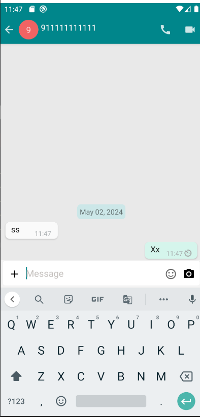

# mesibo_sample_app

## Problem
the sending of message is not working. you can verify that by following steps
1. login from 1st device as user 1
2. login from 2nd device as user 2
3. send messsage form user 1 to user 2
4. you wont receive the message and also the listener `Mesibo_onMessageStatus` is not called which further verifies that message is not sent

## more info
1. platform and api version that we encountered this issue on : we tested using `mesibo_flutter_sdk v2.2.17` on android api level 34, 33 , 29 , we tested on real device as well as emulator
2. mesibo app id: `366532`
3. mesibo app token:  `tvjt0pdj4xd67rgknpc9mi0z1nifrom667iubjobeeajkq8ofaz58cnyt8khkogy`
4. Mesibo connection status: as you can see from the logs, it is `Mesibo.MESIBO_STATUS_ONLINE`
5. logs:
   user 1 logs:
```
D/EGL_emulation( 6201): app_time_stats: avg=3223.43ms min=3.58ms max=90088.07ms count=28
I/MesiboCore ( 6201): E0105-165022-960(6201)(stop): stop called by API, s: 70
I/MesiboCore ( 6201): E0105-165022-961(6201)(stop): stop called by API, s: 70
I/MesiboCore ( 6201): E0105-165022-962(6201)(set_credentials): waiting for stop() to complete
I/MesiboCore ( 6201): E0105-165022-961(6264)(main_thread): mesibo api stopped: reason 1 0 (3)
I/MesiboCore ( 6201): E0105-165023-013(6201)(set_credentials): stopped
D/EGL_emulation( 6201): app_time_stats: avg=108223.55ms min=108223.55ms max=108223.55ms count=1
I/MesiboCore ( 6201): E0105-165023-630(6201)(start): mesibo android api: 2.4.5 protocol: 2.4.2 os: 33 app: com.yoliday.experience
I/MesiboCore ( 6201): E0105-165023-631(6201)(start): starting mesibo
I/flutter ( 6201): Mesibo_onConnectionStatus: 2
I/flutter ( 6201): Mesibo_onConnectionStatus: 5
I/flutter ( 6201): Mesibo_onConnectionStatus: 6
I/flutter ( 6201): Mesibo_onConnectionStatus: 1
D/EGL_emulation( 6201): app_time_stats: avg=32.55ms min=3.85ms max=415.80ms count=21
D/EGL_emulation( 6201): app_time_stats: avg=198.16ms min=13.24ms max=916.15ms count=5
I/flutter ( 6201): Mesibo_onMessage: from: (Mohamed) group: () Message: Hello from Flutter
```
   user 2 logs:
```
I/MesiboCore (  961): E0105-175022-954(2103)(main_loop): mesibo - user signed-in from another device...exiting   
I/MesiboCore (  961): E0105-175022-955(2103)(main_thread): mesibo api stopped: reason 4 0 (3)
I/flutter (  961): Mesibo_onConnectionStatus: 5
I/MesiboCore (  961): E0105-175121-944(961)(start): mesibo android api: 2.4.5 protocol: 2.4.2 os: 29 app: com.yoliday.experience
I/MesiboCore (  961): E0105-175121-944(961)(start): starting mesibo
I/flutter (  961): Mesibo_onConnectionStatus: 6
I/flutter (  961): Mesibo_onConnectionStatus: 1
```

## additional info requested by mesibo
1. Q. Did the issue arise due to an API upgrade? : no it happened suddenly without us changing the mesibo_flutter_sdk version.
2. Q. If so, did you try the previous version? Did the previous version work? : we were on `mesibo_flutter_sdk 2.2.16` when this happened so we tried to run it with previous versions such as `v2.2.13` and `v2.2.14` but we faced the same issue, then we upgraded to latest `v2.2.17` but we faced the same issue with it.
3. Q. If not, what changes you made that triggered the issue?: we haven't changed any code from our side, it suddenly stopped working, you can see that this flutter sample app is from mesibo itself , we just changed the tokens and package name to make it work with our tokens.
4. Q. When was the last time you tested your application? :we fully tested the sending message functionality of the app last on 26-4-2024 (friday) morning IST , and it was working

## outcome of following the steps provided by mesibo
1. we uninstalled the application from all test devices and Created two brand new users and generated fresh tokens for each.
2. then we tested the messaging by sending the message from user 1 to user 2 but the message was not sent
3. because the message was not sent, we stopped further login from user 2 and sent messages from user 1 again
4. Additionally, we used the mesibo Messenger  web demo at https://mesibo.com/demos/messenger/ as one user (with address: 911111111111 , userId: 6479470 , which has token: 754cc5f8aacaf04cecf6d5d9469b95b9be5bf9223df740e399e334b4948lad475d8d099 ) and we found that message sent from mesibo Messenger  web demo are received in our app but the message is not sent from our app to mesibo Messenger  web demo,as you can see in below screenshot :
 

# NOTE: 
just so there are no confusion , we want to clarify that we are facing issue regarding sending the message (we noticed when the app was working before that when the message is successfully sent from user 1 then the `Mesibo_onMessageStatus` is called for user 1 and we get the updated message status but in this case it is not getting called at all ) , and the issue is not in receiving the message (as you can see by following  steps provided by mesibo,  we can sent message from mesibo Messenger  web demo and receive it in our app)
